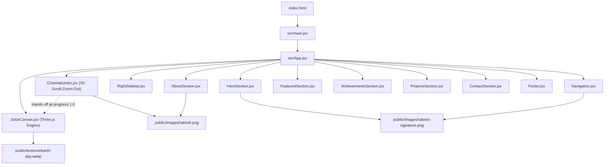

# Codebase Architecture Graph Report: Rakesh Soni Portfolio

Generated by **Graphify** static dependency mapping.

---

## 🏛️ System Overview

The application is an immersive 3D personal portfolio combining **Three.js WebGL rendering** with **React 18** and **Tailwind CSS**. It incorporates an editorial monochrome aesthetic inspired by *arstraumur.music* and an astronomical solar system narrative.

---

## 🧩 Key Subsystems

### 1. 3D WebGL Pipeline
- **`SolarCanvas.jsx`**: Global persistent 3D canvas positioned fixed behind the DOM. Hosts 8 planetary systems, the procedural Helios Sun shader, 5,000 depth-scaled soft circular stars, and real-time celestial telemetry.
- **`CinematicIntro.jsx`**: 100vh sticky scroll scrubber (380vh scroll track) providing a continuous 3D camera flyout from Rakesh at his 3D laptop through the room, procedural 3D city buildings, West Bengal, India, cloud deck, atmosphere, into 3D Earth, with zero cuts.

### 2. State & Scroll Coordination
- While scrolling within `CinematicIntro`, `SolarCanvas` progress is pinned at `0.00` (Earth).
- As the intro completes, the camera and Earth position in `CinematicIntro` line up with `SolarCanvas`'s `#hero` Earth (`(-0.4, 0.4, 10.5)` looking at `(2.8, -0.2, 0)` with Earth at `(3.2, -0.2, 0)`).
- Once the user scrolls past `#hero`, `SolarCanvas` smoothly takes over the orbital journey through the solar system.

### 3. Editorial UI & Design Tokens
- Monochromatic dark palette (`#020308`, `--ink`, `--ink-dim`, `--accent`).
- Typography: `Marcellus` for serif headings and `Inter` for clean technical body copy.
- No heavy opaque cards; content is displayed as spaced editorial lists to keep the 3D celestial canvas visible.
